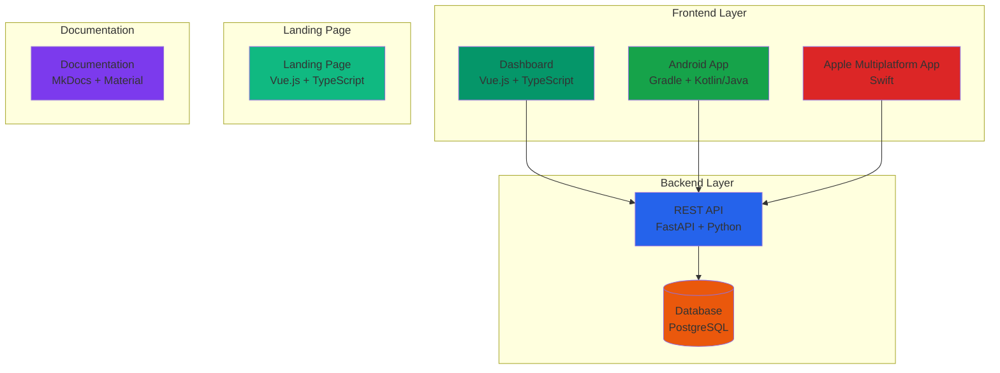
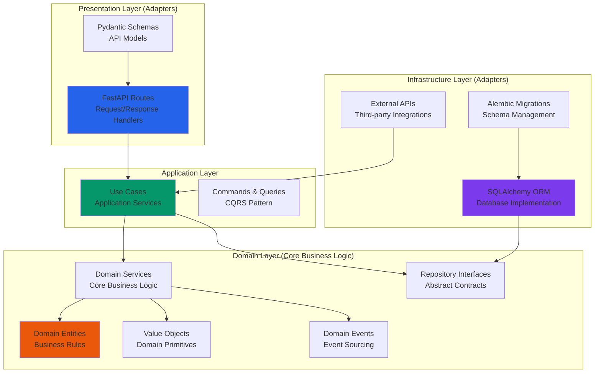

# Architecture

## Technology Stack



### Stack Components

- **FastAPI** - REST API (Python)
- **Vue.js** - Website/Dashboard (TypeScript)
- **Android** - Mobile (Gradle)
- **Apple** - Multiplatform (Swift)
- **MkDocs** - Documentation (Python, Markdown)

## Backend Architecture

The FastAPI backend follows **Hexagonal Architecture** (also known as Ports & Adapters) with **Dependency Inversion Principle** to maintain clean separation of concerns and testability.

### Architecture Layers



### Dependency Flow

**Outer layers depend on inner layers** (Dependency Inversion):
- Infrastructure → Application → Domain (concrete implementations)
- Domain ← Application ← Infrastructure (abstract interfaces)

### Users Domain Example

The `users` domain demonstrates this architecture:

```
api/truledgr_api/users/
├── models.py          # Domain Layer: User entity, value objects
├── repositories.py    # Domain Layer: Abstract repository interface
├── services.py        # Domain Layer: Domain services (business logic)
├── events.py          # Domain Layer: Domain events
├── exceptions.py      # Domain Layer: Domain-specific exceptions
├── dependencies.py    # Application Layer: Dependency injection setup
├── routes.py          # Presentation Layer: FastAPI route handlers
└── schemas.py         # Presentation Layer: Pydantic request/response models
```

**Key Principles:**
- **Domain Independence**: Domain logic has no external dependencies
- **Dependency Inversion**: High-level modules don't depend on low-level modules
- **Testability**: Each layer can be tested in isolation
- **Flexibility**: Infrastructure can be swapped without affecting domain logic

### Users Vertical Slice
The `users` domain implements a complete hexagonal slice:

| Layer | Files | Notes |
|-------|-------|-------|
| Domain | `models.py`, `repositories.py`, `services.py`, value objects (`UserId`, `Email`) | Pure business logic, no framework imports |
| Application | `dependencies.py` | Wires domain with infrastructure via DI providers |
| Infrastructure | `infrastructure.py` | In-memory `InMemoryUserRepository` (replace with SQLAlchemy adapter later) |
| Presentation | `routes.py`, `schemas.py` | FastAPI endpoints + Pydantic schemas |
| Tests | `api/tests/test_users.py` | Validates CRUD, state changes, deletion rules |

All outer layers depend inward on the domain abstractions (`UserRepository`). Swapping the repository to a database-backed implementation requires only changing `dependencies.py` and adding a new adapter—no changes to domain or routes.

## Architecture Principles & FAQ

### Settings Configuration

**Approach:**
- **Hexagonal**: Infrastructure adapters configured at boundaries
- **DDD**: Each bounded context manages its own configuration
- **Type Safety**: Pydantic validates all settings
- **Testability**: Easy to override settings in tests
- **Scalability**: New modules can add settings independently

### Import Rules & Module Dependencies

#### ✅ **Q: Should DDD modules import from Core?**

**A: YES - DDD modules SHOULD import from Core (with boundaries)**

DDD modules are **allowed** to import from `core` for:

**1. Infrastructure abstractions:**
```python
from ..core.database import DatabaseProvider, SQLAlchemyProvider  # ✅
from ..core.database import InMemoryProvider                       # ✅
```

**2. Shared kernel (cross-cutting concerns):**
```python
from ..core.settings import settings              # ✅
from ..core.exceptions import ApplicationError    # ✅
from ..core.auth import get_current_user         # ✅
```

**3. Application-level coordination:**
- Event bus
- Background tasks
- Caching
- Logging configuration

**Why this is correct:**
- Core is **infrastructure/shared kernel** - designed to be reused
- Vertical slices (Users, Orders, etc.) use shared infrastructure
- No domain-to-domain coupling
- Follows dependency rule: `Domain ← Application ← Infrastructure`

**Example (current implementation):**
```python
# api/users/dependencies.py ✅
from ..core.database import DatabaseProvider, SQLAlchemyProvider
from ..core.settings import settings

# api/users/database/sqlalchemy.py ✅
from ...core.database import DatabaseProvider, SQLAlchemySession
```

#### ❌ **Q: Should Core import from DDD modules (like Users)?**

**A: NO - Core should NEVER import from DDD modules**

This would **violate the dependency rule** and create circular dependencies.

**Wrong - Core importing from modules:**
```python
# api/core/database/provider.py
from api.users.database.sqlalchemy import Base as UsersBase  # ❌ WRONG
from api.orders.database.sqlalchemy import Base as OrdersBase # ❌ WRONG
```

**Problems:**
- Circular dependency: `Core ← Users → Core`
- Core becomes coupled to specific modules
- Can't add new modules without modifying core
- Breaks separation of concerns

**The dependency rule:**
```
Modules → Core  ✅ (allowed)
Core → Modules  ❌ NEVER
```

**Correct approach - Registration pattern:**
```python
# api/core/database/registry.py ✅
class DatabaseRegistry:
    def __init__(self):
        self._bases = []

    def register_base(self, base):
        """Modules register themselves with core."""
        self._bases.append(base)

# api/users/dependencies.py ✅
from api.core.database import registry
from .database.sqlalchemy import Base

# Module registers with core (not the other way around)
registry.register_base(Base)
```

#### ❌ **Not Allowed: Domain-to-Domain Dependencies**

Modules should **NEVER** import from other DDD modules:

```python
# ❌ WRONG - Creates coupling between bounded contexts
from ..orders.models import Order
from ..payments.services import PaymentService
from ..inventory.repositories import ProductRepository
```

**Why not allowed:**
- Creates tight coupling between contexts
- Violates bounded context boundaries
- Makes modules non-independent
- Prevents parallel development

**Correct approach - Use events or application layer coordination:**
```python
# ✅ Users module publishes event
event_bus.publish(UserCreatedEvent(user_id=user.id))

# ✅ Orders module subscribes to event (loose coupling)
@event_bus.subscribe(UserCreatedEvent)
async def on_user_created(event):
    # Orders module reacts without importing Users
    pass
```

### Recommended Structure

```
api/
├── core/                    # Shared infrastructure & kernel
│   ├── database/            # ← All modules import from here
│   ├── settings.py          # ← All modules import from here
│   ├── exceptions.py        # ← Shared exceptions
│   ├── events/              # ← Event bus (if needed)
│   └── auth/                # ← Authentication (cross-cutting)
│
├── shared/                  # Truly shared domain concepts (rare)
│   └── value_objects/       # Email, Money, Address (if used by multiple contexts)
│
├── users/                   # Bounded context
│   ├── models.py            # ← Never imports from other modules
│   ├── database/            # ← Can import core.database
│   ├── services.py          # ← Only imports from users.*
│   └── dependencies.py      # ← Can import core.*
│
└── orders/                  # Another bounded context
    ├── models.py            # ← Never imports from users
    └── dependencies.py      # ← Can import core.*, NOT users.*
```

### Import Rules Summary

| Layer | Can Import From | Cannot Import From |
|-------|----------------|-------------------|
| **Modules** (Users, Orders) | `core.*`, `shared.*` | Other modules |
| **Core** | Standard library, external packages | Any modules, `shared.*` |
| **Shared** | Standard library | `core.*`, modules |
| **Application** (main.py) | Everything | N/A (top level) |

### The Golden Rule

**"Core is not a module, it's the foundation."**

- **Core** = Infrastructure + shared utilities (OK to import)
- **Shared** = Truly shared domain concepts (rare, but OK if needed)
- **Modules** = Bounded contexts (NEVER import from each other)

### When to Move Code to Shared

Move to `api/shared/` **only if**:

1. **Truly shared domain concept** (e.g., `Email`, `Money`, `Address` value objects used by multiple contexts)
2. **Not infrastructure** (infrastructure stays in `core`)
3. **Stable and unlikely to change**

**Example of legitimate shared code:**
```python
# api/shared/value_objects.py
class Email:
    """Shared value object used by Users, Customers, Vendors."""
    def __init__(self, value: str):
        if not self._is_valid(value):
            raise ValueError(f"Invalid email: {value}")
        self.value = value

class Money:
    """Shared value object used by Orders, Payments, Invoices."""
    def __init__(self, amount: Decimal, currency: str):
        self.amount = amount
        self.currency = currency
```

### Dependency Flow Diagram

```
┌──────────────────────────────────────────────────────┐
│           Application Layer (main.py)                 │
│  - Wires everything together                          │
│  - Can import from core AND modules                   │
└────────────┬─────────────────────────────────────────┘
             │
      ┌──────┴───────┐
      ▼              ▼
┌─────────────┐  ┌─────────────┐
│   Users     │  │   Orders    │  DDD Modules
│   Module    │  │   Module    │  (Bounded Contexts)
│      ↓      │  │      ↓      │
│  Can import │  │  Can import │
│  from core  │  │  from core  │
└──────┬──────┘  └──────┬──────┘
       │                │
       └────────┬───────┘
                ▼
       ┌─────────────────┐
       │      Core        │  Infrastructure
       │  (Infrastructure)│  (Database, Settings, etc.)
       │                  │  ← NEVER imports from modules
       └─────────────────┘
                │
                ▼
       ┌─────────────────┐
       │  External Libs   │  FastAPI, SQLAlchemy,
       │  & Stdlib        │  Pydantic, etc.
       └─────────────────┘
```
